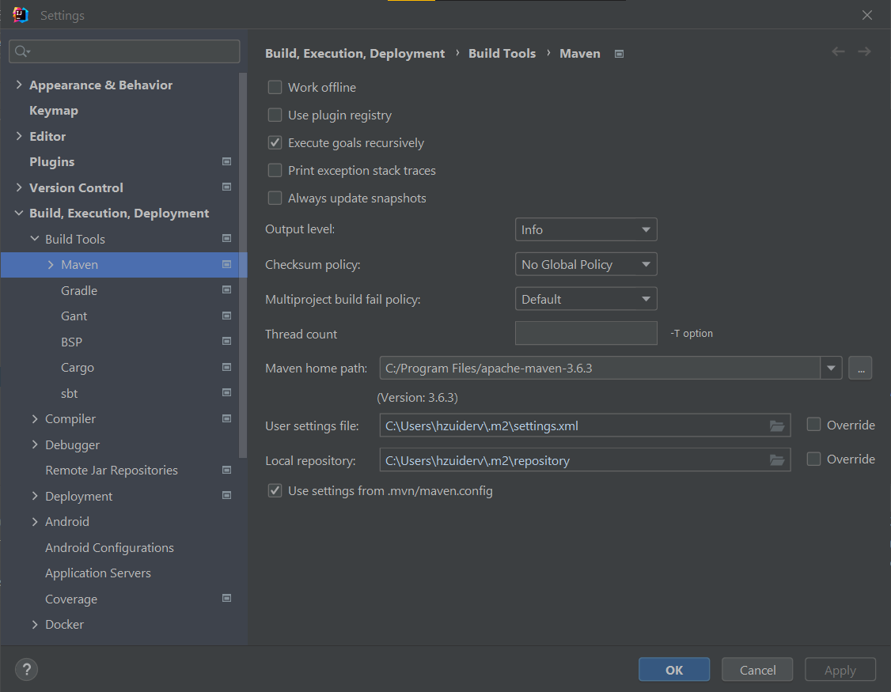

## Hzt Utils

---
This is a utility library consisting of different modules.

Author: Hans Zuidervaart

---

### Modules

Each module contains its own README.md. Click the links below to view them

- [Core](/core/README.md) contains an extended and functional collections api. Inspired by Kotlin collections.
- [Reflection](reflection/README.md)
- [Geometry](geometry/README.md)
- [Graph utils](graph-utils/README.md)
- [Fx utils](fx-utils/README.md) contains some util functions for javaFX applications
- [Swing utils](/swing-utils/README.md) contains some functional interfaces for easier functional programming in swing.
  It also contains some component builders.
- [Test data generator](/test-data-generator/README.md) Contains an api that provides test data for easy testing
- [Benchmark project](/benchmark/README.md) a project to benchmark the Sequence api found in the core module

---

### Running tests

Run `mvn clean test` to run all tests using mvn

If you get a module not found error while trying to run the tests via intellij,
then first do a `mvn clean install` from here. After that,
check that your intellij Maven-home-path is set to your local maven installation.


---

### Usage

Run `mvn clean install` to install this project as a dependency in your local mvn repo

Add the following dependency to your project:

````xml

<dependency>
    <groupId>org.hzt.utils</groupId>
    <artifactId>hzt-utils</artifactId>
    <version>${hzt.utils.version}</version>
</dependency>
````

See the tests in the models of this project to see how the utilities can be used

---

### Versions

The hzt utils repo contains a java 8, a java 11 and a java 17 version.

The master branch is updated with the java 11 version. The java 11 branch can be seen as the master-dev version

Below table gives an overview of the versioning so far:

| java 8  | java 11 | java 17 |
|---------|---------|---------|
| 7.1.8   | 7.11    | 7.17    |
| 7.5.1.8 | 7.5.11  | 7.5.17  |

---

### Sources

- [Design Patterns in the Light of Lambda Expressions. Venkat Subramaniam, Agile developer, inc](https://www.youtube.com/watch?v=WN9kgdSVhDo)
- [Kotlin docs](https://kotlinlang.org/docs/home.html)
- [Live templates](https://www.youtube.com/watch?v=Sio9MdSqXZo)
- [Junit5 User guide](https://junit.org/junit5/docs/current/user-guide/)
- [How to publish a Java library to Maven Central - Complete Guide](https://maciejwalkowiak.com/blog/guide-java-publish-to-maven-central/)

---
