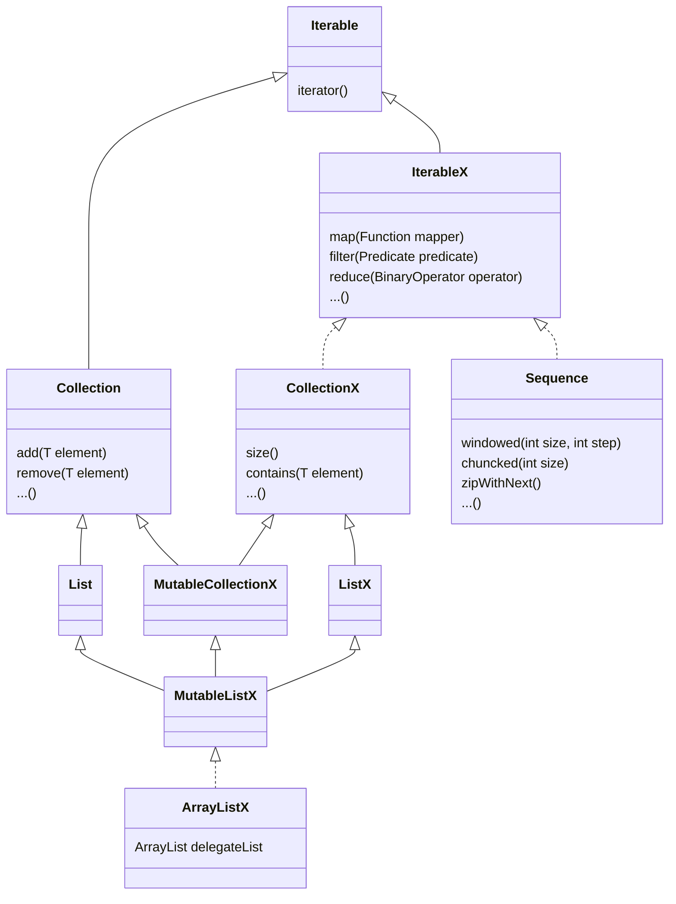

## Hzt Utils Core

---
This is a utility library for working with java collections in a functional style. Inspired by Kotlin-Collections.

Author: Hans Zuidervaart

---
### Architecture
This diagram displays a part and a simplified version of the architecture.
The Iterable, Collection and List interfaces displayed in the diagrams are the familiar java.util interfaces.



---
## Usage
Open this project and execute `mvn clean install` under the root of the core module

Add the following dependency to your project:
````xml
    <dependency>
        <groupId>org.hzt.utils</groupId>
        <artifactId>core</artifactId>
        <version>${hzt.utils.version}</version>
    </dependency>
````

I'm planning to also make this dependency available at maven central

---
### CollectionsX-framework
The collectionsX-framework is an extension to the java standard collections-framework. 

It contains an api and some implementations for immutable collections and also mutable ones. 

Collections are Immutable by default after creation.

The MutableCollection classes always start their name with `Mutable`.

The [CollectionsX](src/main/java/org/hzt/utils/collections/CollectionX.java) 
interface contains functional style default methods for map, filter and other well-known
functional operations. So every collection that extends this interface, also gets these methods for free in its namespace. 

It extends the java.util.Iterable interface. This interface is used to iterate over the elements in the functional style methods.
It does not extend the java.util.Collection interface because I didn't want the mutator methods like for example `add` and `remove`
to pollute the namespace.

The [MutableCollectionX](src/main/java/org/hzt/utils/collections/MutableCollectionX.java) interface extends the CollectionX interface as well as
the java.util.Collection interface.

###### An example of an immutable list on which the map method is called:
```java
    ListX<String> list = ListX.of("This is a test");

    ListX<Integer> stringSizes = list.map(String::length);
    
    assertEquals(ListX.of(4, 2, 1, 4), stringSizes);
```

###### An example of an immutable list on which the filter method is called:
```java
    ListX<Integer> list = ListX.of(1, 2, 3, 4, 5, 6, 5);

    ListX<Integer> evenNrs = list.filter(IntX::isEven);
    
    assertEquals(ListX.of(2, 4, 6), evenNrs);
```
All transformation methods on CollectionX extending classes are eagerly evaluated. So it is advised not to chain to many operations.

For longer chains and operations over larger collections, the [Sequence api](src/main/java/org/hzt/utils/sequences/Sequence.java),
discussed in the next section, can be used to iterate over the elements in a lazy way.

More examples can be found in the test classes in the collections [test package](src/test/java/org/hzt/utils/collections)

The api is mostly inspired by the kotlin Collections framework.

---
### Sequences
A sequence is a lazy evaluated pipeline implementation based on the iterator.

A sequence can be constructed of any class extending the Iterable interface using the `Sequnece.of(Iterabe<T> iterable)` method.
This method is also overloaded to accept a vararg array: `Seqeunce.of(T... array)`.

###### - map -> filter -> toSet
````java
class Samples() {
    
    @Test
    void testMapFilterToSetX() {
        ListX<String> list = ListX.of("Hello", "this", "is", "a", "test");

        final SetX<Integer> set = Sequence.of(list)
                .map(String::length)
                .filter(l -> l > 3)
                .toSetx();

        assertEquals(Setx.of(5, 4), set);
    }
}
````
For more examples, look in the test class [SequenceTest.java](src/test/java/org/hzt/utils/sequences/SequenceTest.java)
or on one of the other packages under test

---
### Sources
- [Kotlin docs](https://kotlinlang.org/docs/home.html)
- [Mermaid: Visualizations using text and code](https://mermaid-js.github.io/mermaid/#/)

